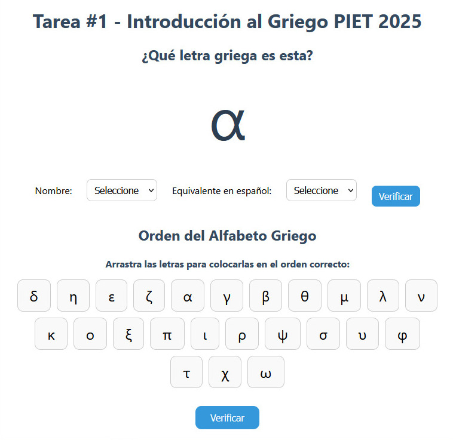

# 🏛️ Aplicación de Letras Griegas (Koiné)

Esta es una aplicación web interactiva para aprender y practicar letras del alfabeto griego (Koiné). Permite visualizar, arrastrar, y verificar combinaciones de letras. Ideal para una primer acercamiento al idioma del Nuevo Testamento.

---

## 📸 Captura



> 💡 Asegúrate de tener la imagen `screenshot.png` en la raíz del repositorio o cambia la ruta según dónde esté.

---

## 🚀 Cómo usar

1. Cloná el repositorio o descargalo en tu computadora:
   ```bash
   git clone https://github.com/tu-usuario/tu-repo.git
